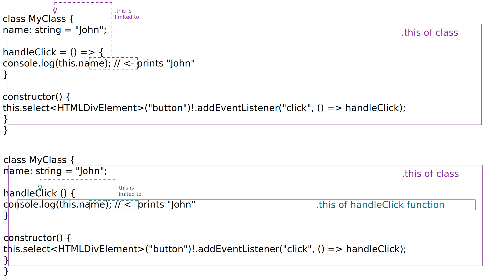

## Why is this.myValue null in my callback function?

A common issue is that your callback function is defined as a _normal_ function instead of an _arrow_ function.

Arrow functions are an alternative way of writing functions:

### Syntax

Inside a class:
- Normal function: `myFunction(param1, param2) {...}`
- Arrow function: `myFunction = (param1, param2) => {...}`

Outside a class:
- Normal function: `function myFunction(param1, param2) {...}`
- Arrow function: `const myFunction = (param1, param2) => {...}`

### Difference between normal and arrow functions

The difference between normal functions and arrow functions is, that arrow functions don't have their own `this` keyword. Therefore, they should be used e.g. as event listeners to access the _outside_ `this` keyword.

E.g. this code would work as you expect:

```ts
class MyClass {
  name: string = "John";
  
  handleClick = () => {
    console.log(this.name); // <- prints "John"
  }
  
  constructor() {
    this.select<HTMLDivElement>("button")!.addEventListener("click", () => handleClick);
  }
}
```

However, using normal functions would not work:

```ts
class MyClass {
  name: string = "John";
  
  handleClick () {
    console.log(this.name);  // <- will print "undefined", because
    // because normal functions have their own `this`, 
    // which is different from the _outside_ `this` keyword.
  }
  
  constructor() {
    this.select<HTMLDivElement>("button")!.addEventListener("click", () => handleClick);
  }
}
```

### Illustration

