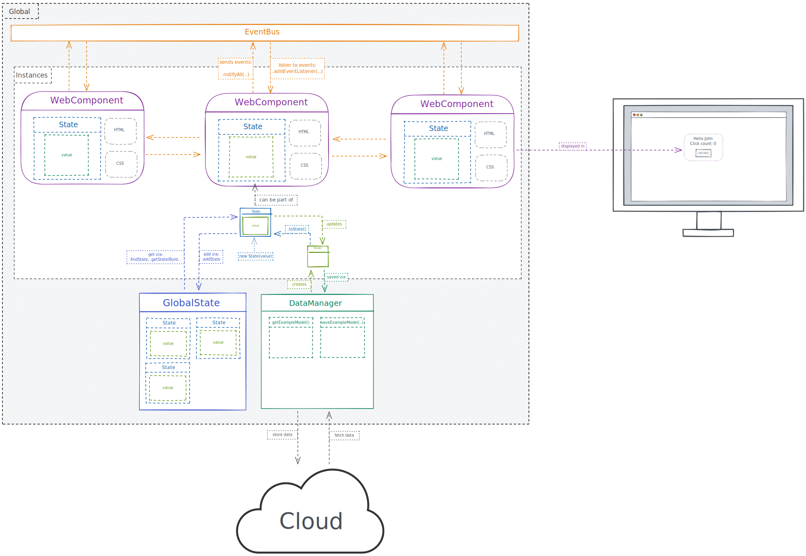

## 📖 Lib Documentation (starter template)

### How to: Create Components

*tldr: Extend `WebComponent` to define your own components.*

- [WebComponent](lib/WebComponent.md)

### How to: Communicate

*tldr: Communication is based on the pubSub pattern. Extend `Observable` to make your class observable, use `EventBus` for global communication.*

- [Observable](lib/Observable.md)
- [EventBus](lib/EventBus.md)

### How to: Manage state

*tldr: Create Models to define data structures, use them via States in your Components. Use GlobalState to store globally needed States.*

- [Model](lib/Model.md)
- [State](lib/State.md)
- [GlobalState](lib/GlobalState.md)

### How to: Get Data

*tldr: Use DataManager to fetch/save data as Models from external APIs or Databases.*

- [DataManager](lib/DataManager.md)

## 🌅 Cheat Sheet

